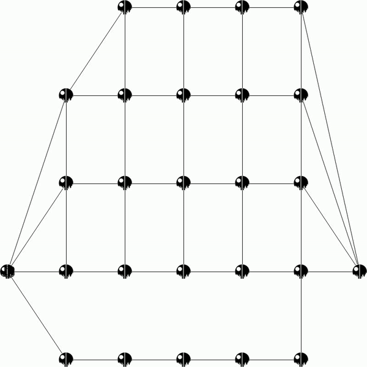

# Lem-in

## Quick start

1. Download:
    ```bash
    git clone https://github.com/artemk1337/lem-in.git
    ```
2. Install:
    ```bash
    make
    ```
3. Run:
    ```bash
    ./generator <flag> | ./lem-in
	```
	or  
	```bash
	./generator <flag> | ./lem-in -v
    ```
	or  
	```bash
	./generator <flag> | ./lem-in | python3 visualizer.py
    ```
	Visualizer example:  
	
	  
	
See `./generator --help` for usage flags.

## Algorithms
1. Bellman–Ford - algorithm that computes shortest paths from a single source vertex to all of the other vertices in a weighted digraph. https://en.wikipedia.org/wiki/Bellman–Ford_algorithm
2. Suurballe - node-disjoint path finding algorithm http://www.macfreek.nl/memory/Disjoint_Path_Finding

## Compatibility  
Generator works only on Mac OS.    
Programming language: C.
